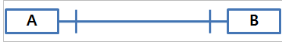
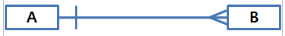
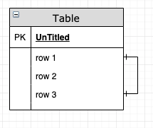
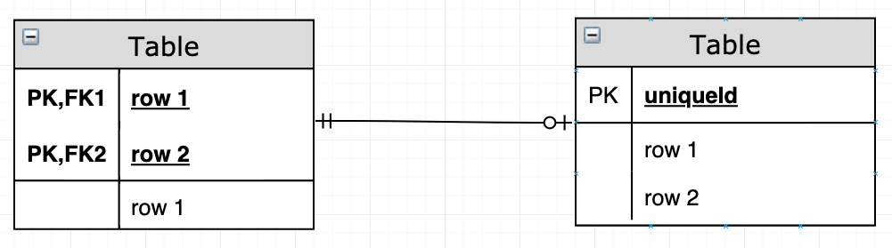

# Entity Relationships Diagram

 개체-연관성 다이어그램(entity-relationships diagram, ER Model)은 관계형 DB에서 테이블의 관계를 query가 아닌 다른 방법으로 표현하고, 이해하기 쉽도록 도식화한 모델을 말한다.

 

 1대1 관계에 대한 다이어그램이다. A 테이블과 B 테이블을 잇는 수평선에 직각으로 수선이 그어져 있는 것은 한개의 레코드만 연결이 되어있다는 뜻이다. 또한 테이블과 테이블을 잇는 이 수평선을 포함하여 수직선 등등 **연결선을 까마귀 발(crow feet)**이라고 부른다.

 

 1대many 관계에 대한 다이어그램이다. A 테이블의 한 레코드가 B 테이블을 잇는 수평선에 A 테이블은 수직으로 수평선이 그어져 있고, B 테이블은 여러갈래로 나뉘어져 수평선이 그러져 있지 않다. 이는 A 테이블의 한 레코드가 B 테이블의 여러 레코드와 연관이 있다는  의미이다.

 

 테이블이 재귀적 특성을 가지고 있다면, 까마귀 발을 스스로에게 연결하면 된다.

## 참여의 종류

 관계형 테이블을 구성하는데 있어서, 참여의 종류를 정해야만한다. 한번 예시들 들어보자. 고객 테이블과 직원 테이블이 있다고 했을 때, 새로운 고객이 생겼을 때는 필수적으로 직원이 할당되어야 한다. 하지만 직원 테이블의 경우 고용이 될때 마다 레코드가 추가되기 때문에 영향을 받지 않는다.

 위의 상황에서 고객 테이블은 의무적 유형(mandatory)이고, 고객 테이블은 선택적 유형(optional)이다.

 

 참여의 종류를 다이어그램으로 나타낼 때

- 선 2개는 의무적 참여의 종류를 나타낸다.
- 원은 선택적 참여의 종류를 나타낸다.
