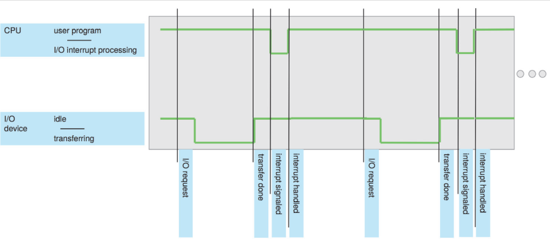
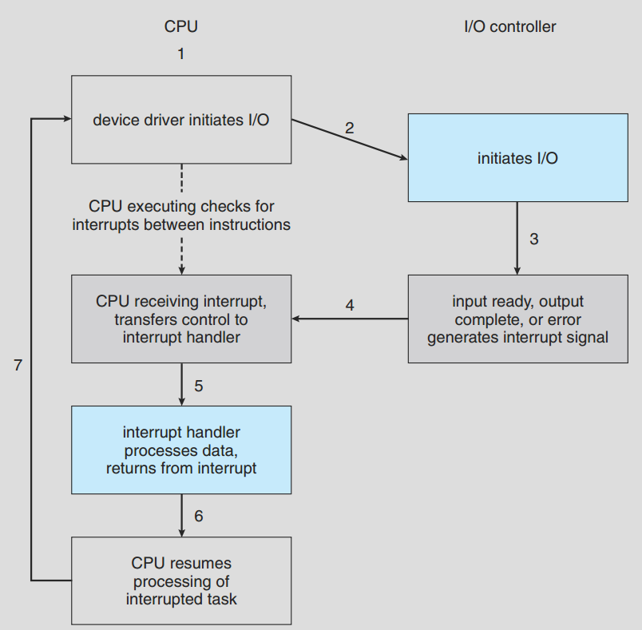

# Interrupt

 CPU는 여러 요소에 의해 인터럽트(interrupt)가 걸린다. 이때 interrupt란 프로그램이 실행도중 다른 프로그램에 의해 현재 CPU 점유를 잠시 넘겨주는 것이다. 하지만 이게 process priority에 따라 넘겨주는 것일 수도 있고, I/O interrupt에 의해 넘겨주는 것일 수도 있고, error에 의해 interrupt를 넘겨줄 수도 있다. 이렇든 여러 상황에 의해 interrupt가 발생한다.

 위 그림을 보자 user program이 실행되던 도중 I/O device로 부터 입력이 들어와 I/O request가 발생한다. 그러면 user program은 transfering이 끝나기 까지 계속 실행하다가 interrupt 신호를 처리후 다시 원래 프로그램을 실행한다. 이때 알아둬야할 점은 user program은 interrupt를 실행하는 동안 멈춘다는 것이다.

 이를 자세한 diagram으로 보면 아래와 같다.

 interrupt는 두가지 종류가 있다. 하나는 nonmaskable interrupt이고, 다른 하나는 maskable interrupt이다. nonmaskable은 예약항목으로 특정한 event에만 반응을 한다.

 interrupt는 가능한 모든 process가 cpu를 사용할 수 있도록 만들며, 비동기 event를 위해 설계되기도 하였다.