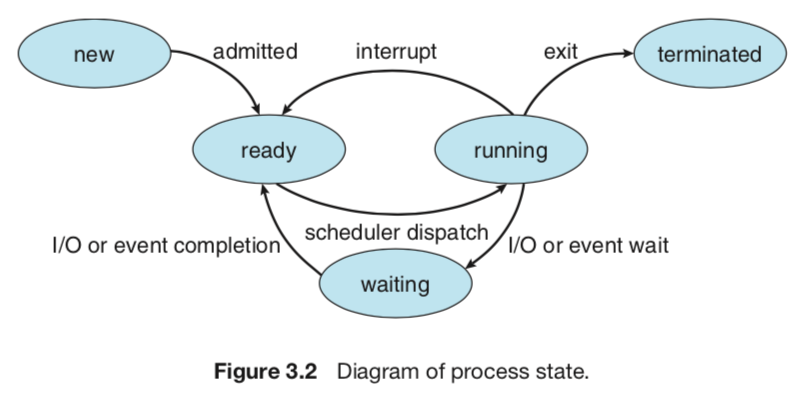

# Process Concept

 현재 활동하고 있는 프로세스의 상태는 프로그램 카운터(program counter, PC)와 processor의 register로 알수있다. 

 학교에서 프로그래밍을 배우면서 메모리 구조를 배웠을 때는, **[stack, heap, data, text]가 일렬로 존재한다는 것**만 배웠다. 하지만 거기다가 stack은 메모리 구조상에서 맨위에서 주소를 `-`하면서 가변영역을 확장/축소 하고 heap은 `+`하면서 가변영역을 확장/축소한다.

 함수가 호출될 때마다, 함수 파라미터, 지역 변수, 반환 주소를 포함한 activation record가 stack에 쌓인다. 함수에서 반환을 제어할때, activation record는 stack에서 뽑아온다.

 프로그램은 프로세스가 아니다. 프로그램은 HDD의 파일처럼 passive 상태이고, 프로세스는 active 상태이다. 프로그램 카운터가 다음에 실행할 명령어나, 자원을 특정할 때 처럼말이다.

## Process State

 프로그램이 실행되면 상태가 변한다.

- new: 프로세스가 생성됨
- running: 명령 실행 중
- waiting: process가 event 발생을 대기 중 (I/O completion, 신호 대기)
- ready: 프로세스가 processor 할당을 대기 중
- terminated: 프로세스 실행 종료
