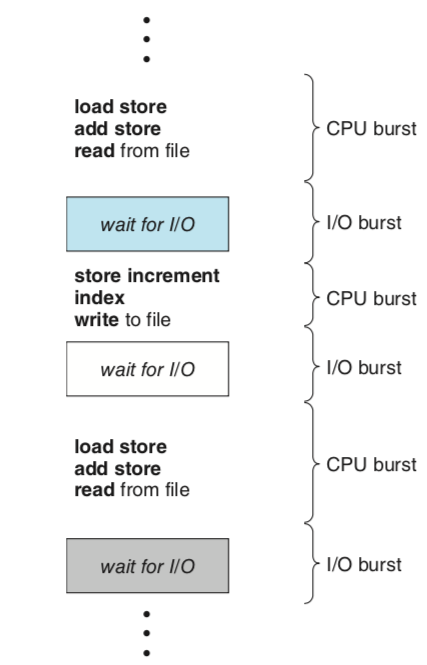
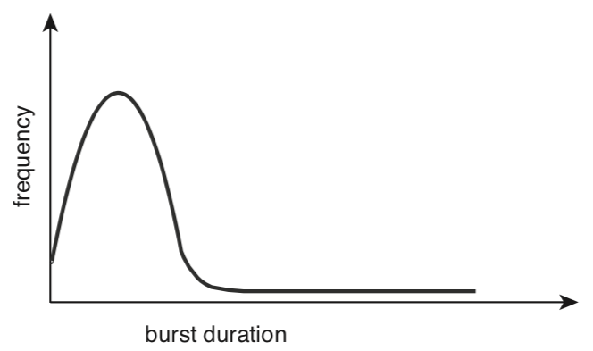
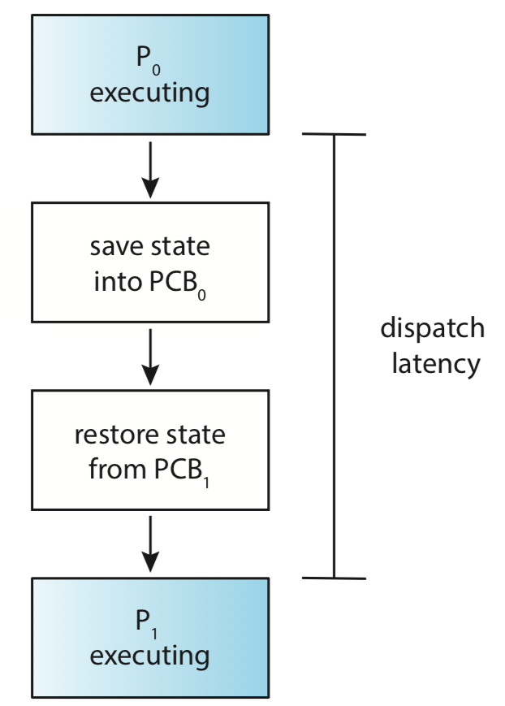

# CPU Scheduling

 CPU scheduling은 multiprogram OS에 기본이 된다. 아주 잠깐의 시간에 여러 프로그램을 빠르게 번갈아가면서 연산한다. 그래서 `프로그램이 동시에 동작하는 것`처럼 보이게 한다.

 학습 목표

- 여러 CPU scheduling 알고리즘을 이해한다.
- CPU scheduling 알고리즘을 성능에 따라 평가한다.
- multi core, multiprocessor의 issue를 설명할 수 있다.
- 여러 Realtime CPU scheduling 알고리즘을 설명할 수 있다.
- Windows, Linux, Solaris에서 사용되는 CPU scheduling 알고리즘을 설명할 수 있다.
- modeling과 situation을 scheduling alogrithm을 측정하는데 적용할 수 있다.
- CPU scheduling 알고리즘을 프로그램으로 구현할 수 있다.

 프로그램의 실행은 CPU 연산과 I/O wait의 cycle로 이루어진다. 프로세스는 CPU burst 후에 I/O burst가 진행되고를 반복한다. 결국엔 CPU burst가 terminal execution을 요청하며 종료된다.

 

 대부분의 CPU는 burst 중 연산이 빠른 기간과 느린 기간이 있다. I/O-bound 프로그램은 대부분 short duration burst를 진행하고, CPU-bound 프로그램은 대부분 long duration burst를 진행한다.

 

## Preemtpive Scheduling

 scheduler는 아래 4가지 상황에서 결정을 내릴 운영이 갈린다.

1. 프로세스가 **동작**에서 **대기**로 바뀔 때(*예를들어 I/O request, child process의 종료로 wait()를 호출할 때*)
2. 프로세스가 **동작**에서 **준비**로 바뀔 때(*예를들어 interrupt가 발생했을 때*)
3. 프로세스가 **대기**에서 **준비**로 바뀔 때(*I/O가 완료됐을 때*)
4. 프로세스가 **종료**될 때

 상황 1, 4에서는 scheduling에서 다른 여지가 없다. 하지만 2, 3번은 새로운 프로세스가 선택되어 실행된다.
 상황 1, 4에서만 프로세스가 선택될 때, 비선점 스케줄링이라고 부른다. 반대로 모든 상황에서 프로세스가 선택가능할 때 선점 스케줄링이라고 한다.

 비선점 스케줄링에서 프로세스가 CPU에 할당되었을 때, 종료시키거나 대기상태로 전환시킬 때 까지 프로세스는 CPU를 가진다. 사실상 모든 OS는 선점 스케줄링을 사용한다.

## Dispatcher

 CPU scheduler와 관련된 다른 요소는 dispatcher이다. scheduler에 의해 프로세스가 변경될 때 CPU가 실행되기 위해서는 PCB가 필요하다. 그래서 process가 변경될 때 마다 dispatcher가 현재 프로세스의 PCB를 저장하고, 다음 프로세스의 PCB를 가져온다. 또한 이런 프로세스의 정보를 교체하는 과정을 context switch라고 부른다.

- 프로세스가 변경될 때
- 유저모드로 변경될 때
- user program이 재작동되어 적절한 위치로 점프해야할 때

 위 상황에서 dispatcher는 함수를 호출하여 준비과정을 거친다. dispatcher의 성능은 CPU의 성능을 좌지우지한다. context switching이 일어나는 동안 CPU는 동작을 멈추고 프로세스의 실행준비를 기다려야하기 때문이다.

### volutary/nonvoluntary context switching

 voluntary는 context switching이 일어날 때, process의 CPU에서 더이상할 수 있는 일이 없어 현재 CPU의 주도권을 포기하는 것이다(_예를들어 I/O blocking_).
 non-volutnary는 위와 반대로 time slice가 다하였거나, 우선순위가 높은 다른 process에게 CPU의 주도권을 빼앗기는 것이다.

## Scheduling Criteria

 스케줄링 알고리즘을 공부하기에 앞서, 알고리즘의 성능을 평가할 수 있는 기준들을 살펴보자.

- CPU utilization: CPU를 최대한 사용할 수 있어야 한다.
- throughput: 많은 작업을 완료한다.
- turnaround time: 프로세스가 준비 큐에 쌓인 후로, 완료까지 걸린 시간
- waiting time: 준비 큐에서 프로세스의 실행을 기다리는 시간
- response time: interactivte 시스템에서 유저의 request를 받은 후, 응답하기 시작한 시간.

| criteria | direction |
| --- | --- |
| CPU utilization | maximize |
| throughput | maximize |
| thurnaround time | minimize |
| waiting time | minimize |
| response time | minimize |
