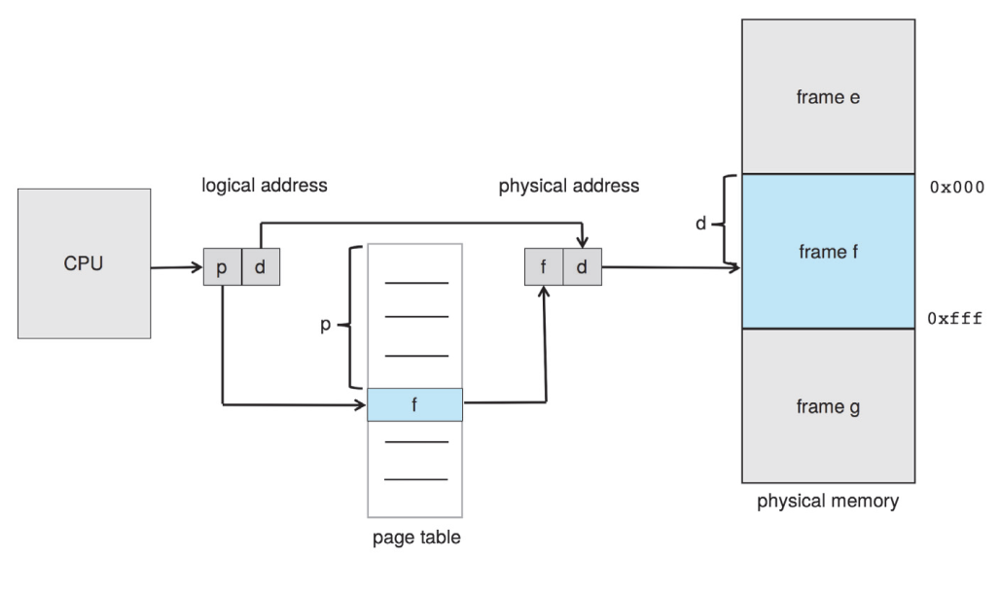

# Memory Management Unit

메모리 주요점

- physical address와 logical address의 차이점, MMU(Memory Management Unit)의 규칙
- 인접메모리 할당의 first-, best-, worst-fit 정책
- internal, external fragmentation을 이해
- TLB를 포함한 paging system에서 logical->physical address 변환 과정
- hierarchcical / hashed paging, inverted page table를 이해
- IA-32, x86-64, ARMv8 아키텍쳐에서 address 변환

base register는 프로세스의 최저 physical address를 가지고있다. limit register는 사용가능한 range size를 가지고 있다. 두 레지스터는 OS만이 특정명령어를 통해 접근가능하다.  프로세스가 커널 메모리 영역이나, 다른 프로세스의 영역을 접근할 경우 fatal error와 같은 방법으로 비정상 접근을 보호한다.

 프로세스는 메모리 요구시 hole(사용가능한 메모리 영역) set에서 메모리를 할당받는다. 프로세스가 종료될 때 메모리가 해제되며 인접한 hole과 합체된다. 이 과정을 **dynamic storage-allocation problem**이라고 한다.

메모리 할당 method

- first fit: set of holes에서 처음 혹은 이전의 first-fit이 끝난 곳부터 탐색하여 첫번째로 할당할만큼 큰 hole을 할당한다.
- best fit: 전체 set를 탐색하여 할당가능한 가장 작은 hole을 할당한다.
- worst fit: 전체 set를 탐색하여 할당가능한 가장 큰 hole을 할당한다. 가장 큰 hole을 할당할 경우 메모리가 많이 남을 경우 다시 hole로 활용할 수 있다.

first fit, best fit은 worst fit보다 시간감소와 공간활용도가 높다. _first fit이 더 빠르다._

## Fragmentation

 first-fit, best-fit 정책은 메모리 할당 정책에서 external fragmentation 문제를 겪는다. 프로세스가 실행/종료되는 과정에서 남은 메모리 공간이 작은 조각들로 부서진다. 최악의 경우 메모리가 요청될 때 많은 수의 작은 hole이 요청된 메모리보다 큰 것이 없어 프로세스를 할당 못할 수도 있다. 심지어 각 Hole의 합이 요청된 메모리보다 더 크더라도 말이다.

 위 external fragmentation의 해결법은 두가지가 있다. 하나는 메모리를 압축하여 한쪽끝으로 메모리를 몰아 큰 hole을 만드는 것이다. 다른 한가지는 메모리가 noncontiguous가 되는 것이다.

## Paging

 위에서 언급했듯이 매모리를 fixed size로 나눠 noncontiguous하게 만드는데, 이렇게 하면 메모리 압축도 되며, external fragmentation을 방지할 수도 있다.

 paging의 기본적인 방법은 physical memory를 일정 사이즈로 쪼갠 **frame**과 logical memory를 일정 사이즈로 쪼갠 page로 이루어져있다.

 프로세스가 실행되면 page는 가능한 frame(a file system or the backing store)으로 loading 된다. **backing store는 page-frame swap시 사용되는 임시공간이다.**

 CPU에서 생성되는 메모리 주소는 page number(p)와 page offset(d)로 이루어져있다. page number는 각 프로세스 안에 내장되어 있는 Page table의 index이다. page table은 각 frame의 base address를 포함하여 offset이 page가 frame으로 변환될 수 있도록 한다.

 MMU가 logical address를 physical address로 변환하는 과정이다.

1. page number p를 page table에서 추출하여 index를 참조한다.
2. page table에서 해당되는 frame number f를 추출한다.
3. page number p를 frame number f로 변환한다.

 offset d는 변하지 않음으로서 frame number와 offset이 physical address로 변환한다.

 paging을 사용하기 위해선 frame 정보도 필요한데, 현재 어느 프레임이 어느 프로세스가 사용되어 있으며, 할당 여부, 할당 가능한 총 프레임수 등등 frame table 또한 존재한다.