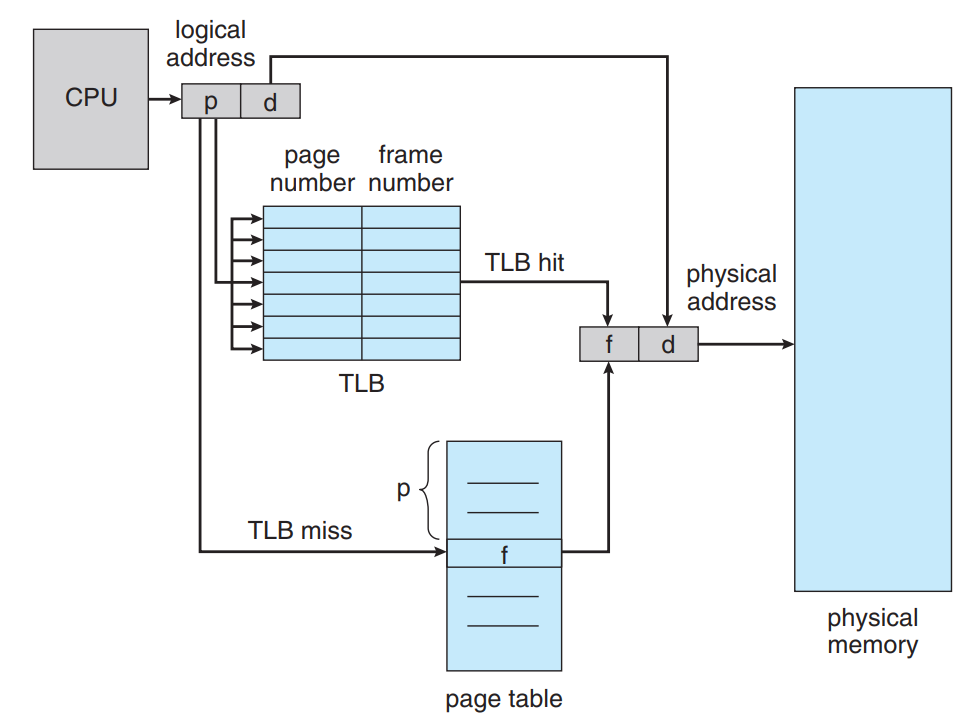

# Transaction Look-aside Buffer

 CPU에서 logical 주소를 생성시 page table이 필요하게 된다. 이때 메인 메모리의 페이지 테이블을 검색하여 원하는 page table을 찾기에는 자원소모가 상당하다. 하드웨어 레벨에서 지원하는 cache page table을 사용한다.

 위에서 말한 cache page table이 Transaction look-adie buffer(TLB)가 되어 CPU에서 주소 변환시 TLB를 먼저 검사하고 만약 있을 경우에는(TLB hit) 그대로 사용하며, 없을 경우(TLB miss) 메모리의 page table에서 변환한다.

## Memory Protection

 page table의 valid-invalid bit를 사용해 page->frame 변환시 bit를 검사하여 비정상적인 접근인지 확인한다. 또 문제점은 logical address space가 0~10468이라고 할때 page단위를 2K로 하면 총 page가 6개가 나오게 된다. 하지만 마지막 페이지는 단 한주소 때문에 나머지 페이지를 버리게 되는 fragmentation현상과 비정상적인 접근임에도 불구하고 page table은 valid하기 때문에 접근가능한 문제가 발생한다.

 위 문제점 때문에 어떤 시스템에서는 page-table length register라고 하는 hardware로 logical address가 valid range에 있는지 검증한다.

## Shared Pages

 asdfㅁㅁ
