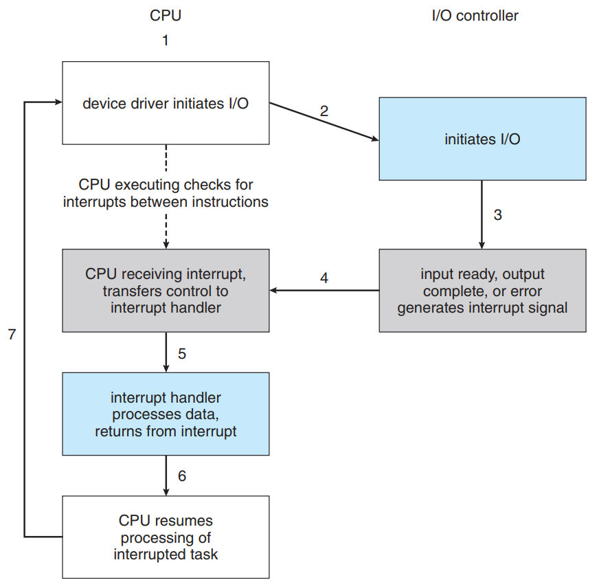

# I/O systems

- OS's I/O subsystem
- I/O hardware의 이론과 복잡성
- I/O hardware와 software의 퍼포먼스 비율

## Interrupts

 CPU가 controller에서 interrupt 신호를 감지했을 때, 현재 상태를 저장하고 memory안에 고정되어 있는 interrupt-handler routine 주소로 점프한다. interrupt는 원인을 파악하고, 최소한의 processing이 실행되어 interrupt처리를 해결한다(**clear**). CPU는 이전에 저장했던 상태를 로드하고 명령을 재실행한다.

 interrupt-handling features

- critical processing 중의 interrupt hadnling 지연
- polling이 일어나지 않고 적절한 interrupt handler를 효과적으로 배치
- multiple concurrent interrupt에 대해 priority를 구분하여 응답
- 몇몇 에러들에 대하여 OS가 즉각 대응

 대부분의 CPU는 두가지 interrupt 요청 라인이 있다. maskable/nonmaskable인데, 이는 CPU가 중요 명령어를 연속처리하기전에 interrupt 요청을 무시할 수 있냐(maskable)/없냐(nonmaskable인데)의 차이다. _maskable interrupt의 종류로서 device controller에서 request service를 보내는 경우가 있다._

