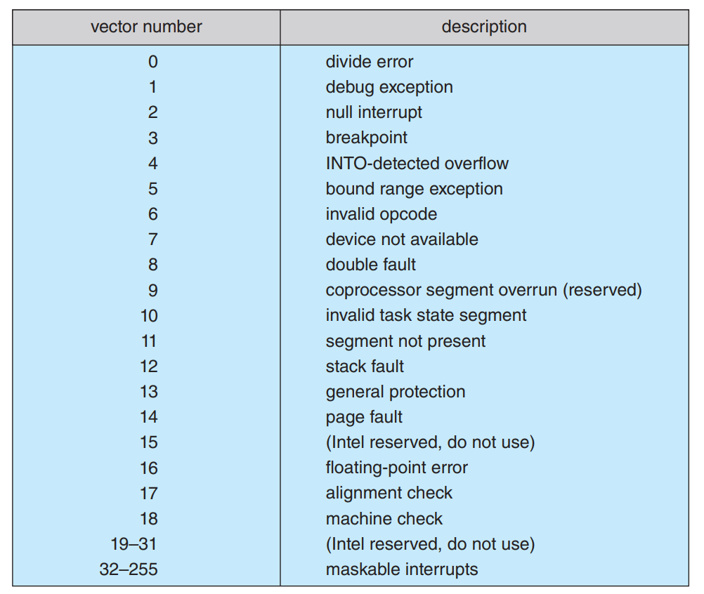

# 6월 18일 TIL 

interrupt 메카니즘은 vector가 가지고 있는 특정 인터럽트 핸들러의 주소를 이용한다.

> I**nterrupt vector**는 interrupt-handling routine table에서 선택된 특정 숫자이다.

> **Interrupt chaining**
각 interrupt vector는 interrupt handler list의 head를 가르키는 것

interrupt handling은 대부분 시간과 자원을 잡아먹고, 실행하기 복잡하다. 시스템은 **first-level interrupt handler(FLIH)**와 **second-level interrupt handler(SLIH)**의 관리를 자주 분할한다. SLIH가 요청된 연산을 하는동안, FLIH는 context switch, state storage, queuing of a handling operation을 실행한다.

## Direct Memory Access

하드디스크와 같은 device가 많은 데이터를 처리할때 general-purpose processor를 사용하는 것은 낭비다.  그래서 이러한 종류의 일을 special-purpose processor, direct-memory-access(DMA) controller 에게 넘긴다.

DMA transfer를 초기화하기 위해, host는 DMA command block을 메모리에 올린다. 

- pointer to source of transfer
- pointer to destination of transfer
- a count of number of bytes to be transferred

scatter-gather method은 single DMA 명령어로 여러 전송이 실행될 수 있도록 해준다. CPU가 command block의 주소를 DMA controller에 쓴 후 다른 작업을 계속한다. DMA controller는 memory bus를 직접 작동하고, 전송을 위해 address를 bus에 올리는 것을 main CPU의 도움없이 수행한다.
